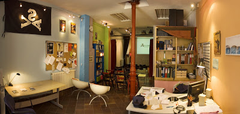

# BARRICUDA LIKELIKE Online

The tiniest MMORPG. Choose an avatar and hang out with your friends in a virtual version of [La Barricuda](http://labarricuda.blogspot.com/2006/10/instalaciones.html).




<a href="http://barricuda-likelike.glitch.me" target="_blank">>>>Try it here<<<</a>

Aventuras visuales is an avant garde cinema school and collective in Madrid (Spain). This is a virtual tribute to 'La Barricuda', their beloved local where the workshops took place, which closed years ago, in 2009.

This project is an extension of original [likelike](https://github.com/molleindustria/likelike-online) by [molleindustria](molleindustria.org) and is commisioned by [arsGames](https://arsgames.net/)

Look [here](https://github.com/molleindustria/likelike-online#readme) for basic usage instructions.


# New features:

## Define actions on NPC clicks

You can define actions to be triggered when clicking NPCs. In this example, clicking the 'divulgadorNpc will execute onDivulgador function, if it exist in your serverMod file.

    var divulgadorNpc = new NPC({
        id: "divulgador",
        nickName: "divulgador",
        room: "r02Entrada",
        x: 64,
        y: 81,
        avatar: 1,
        colors: [2, 2, 1, 5],
        labelColor: "#1e839d",
        actionId: "Divulgador"
    });

## Define actions in text commands

You can define an action inside a text command, to be executed at the time of running the command, or add the postAction attribute to force the execution after closing the text.

    hff00ff: { cmd: "text", txt: "some text", lines: 1, postAction: true, actionId: "MyAction",  label: "click me", point: [65, 95], obstacle: false },

This example runs onMyAction function after the text is closed. onMyAction function must be declared in your serverMod file.

## Debug more accesible

In client.js you will find these selectors. Just set them to true.

    var QUICK_LOGIN = false;
    var DEBUG_CLICKS = false;
    var DEBUG_SPRITES = false;
## Traffic log

Add this to .env file:

```
TRAFFICLOG = true
```

A log file will be created in /logs.  It will register the following actions in a csv file.

* server start

    ```
    timestamp (ISO format), 'serverStart'
    ```

* user login:

    ```
    timeStamp (ISO format), userID, 'join', user name, starting room name, IP address
    ```

* user change room:

    ```
    timeStamp (ISO format), userID, 'room', new room name
    ```

* user focus:

    ```
    timeStamp (ISO format), userID, 'focus'
    ```

* user blur:

    ```
    timeStamp (ISO format), userID, 'blur'
    ```

* user disconnect:

    ```
    timeStamp (ISO format), userID, 'disconnect'
    ```

## Traffic resume by email

You should activate TRaffic log feature for this to work!!!

Add this to .env file to activate this feature:

    ```
    SENDLOG = true
    MAILHOST = SMTP ongoing server
    MAILUSER = mail login
    MAILPASS = password
    MAILTO = to@domain.com
    MAILBCC = bcc@domain.com
    TIMEZONE = "Europe/Madrid"
    ```

TIMEZONE is optional, "GMT" is the default. Look [here](https://raw.githubusercontent.com/node-cron/tz-offset/master/generated/offsets.json) for available timezones. This is important to sync cron tasks with your server locale time.

A few cron tasks will be created:

* A daily task at 00:00AM to rename log file to match current date

* A daily task at 04:00AM to compile previous day logs into one single file

* A weekly task every monday at 6:00AM to compile previous week daily logs into a single file

* A weekly task every monday at 6:30AM to send the previous week log to defined emails.

## Open links in an iframe in the current page

Now you can define a link to open in an iframe inside the current page instead of open it in a new tab. For this, add this attribute in the command definition (valid for areas and things):

    iframe: true

In example:

    h0066ff: { cmd: "text", iframe: true, label: "myLabel", point: [62, 77], txt: 'Intro text', lines: 1, url: "https://www.whatever.com" }

## force scale and offset to modify the appearance of things in the room.

I found a bug in the depthOffset calculation and fixed it to make it scale dependant. Now depth drawing will work with sprites in different scales.

In 'hall' room, look how i set the 'mesa' thing with a fixed offset of 10. Also the depth with the column will work at different avatarScales.

Look at 'sillas' things in the 'classroom' room. Each one uses a different scale and the scene profit from the bug fixed. You can change avatarScale and the depth calculation still works fine.

## perspective mode.

You can define a special function to calculate player scales for each room. This does not affect things, as they are expected to be static. Use scale and offset to align things in perspective. The debug mode draw is very helpfull for this, so i added a yellow line to show the depthOffset (it should be the 'feet' of the sprite at any scale)

Walk into 'cave' room to see it working.

## animated background.  Background become a sprite and can be animated.

Define animated background adding this property "animations" in the data.js

    hall: {
        bg: "/barricuda/entrada-spritesheet.png",
        frames: 4,
        animations: { 
            bg0000: [0, 4], 
            bg0001: [4, 4], 
            bg0010: [8, 4], 
            ...
        },
        frameDelay: 60,
    ...

In this format:

        animations: {
            animName: [startframe, loopDuration (in frames) ]
        }

In our data example you can use the switches in  the hall floor to change animation.

Also, if you enter with admin (use 'admin|pass' as name) you can change bg animation by calling this command:

    /on 1001

or any combination of 4 binary digits, related to:   projector, hall lights, classroom lights, cave lights


change animation in bg:

    module.exports.setBgAnimagion = function (animationName) {
        // emit to all clients
        io.sockets.emit('changeBgAnim', animationName);
    }

This feature is a Work In Progress.

## add surveys inside game

Look at clientMod.js to see how to define a survey. It allows normal inputs, checkbox selectors (with and without images) and radio selectors. Surveys html are auto generated inside a section element added in the index.html.

You can define a function to receive the form answers after been executed, declare it in clientMod and reference it in the postAction attribute when defining the survey.

If log feature is activated, the answers will be recorded in the log.


-----


Code licensed under a GNU Lesser General Public License v2.1.
